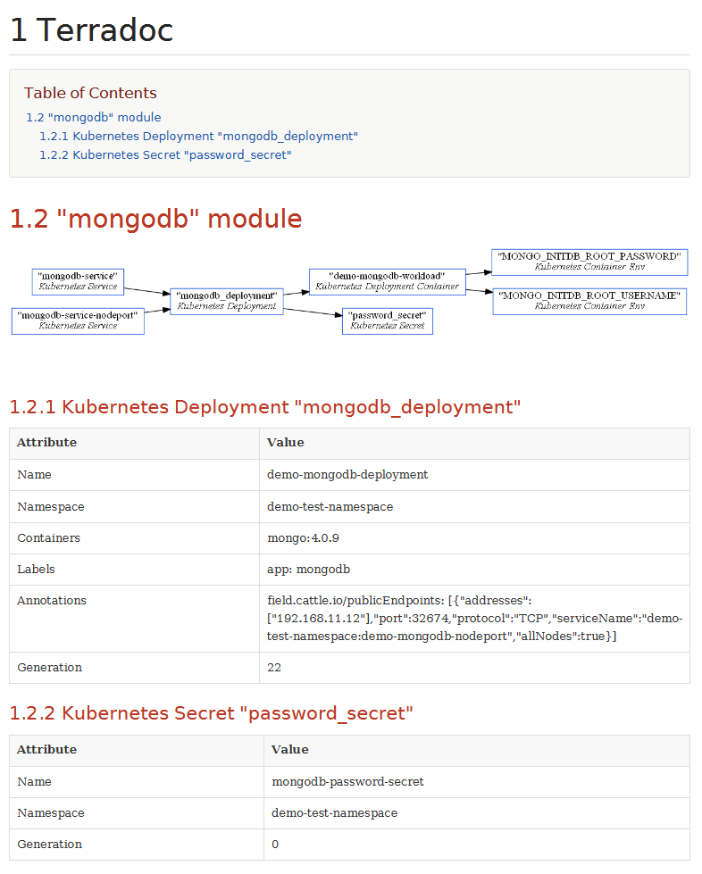

# Terradoc
[](https://opensource.org/licenses/Apache-2.0)

Terradoc is a tool that creates a human readable documentation for your [Terraform](https://www.terraform.io/) provisioned infrastructure.

## Introduction

### Description
With Terradoc you can
* have a documentation that is almost never outdated
* generate human-readable HTML and [AsciiDoc](http://asciidoc.org/) reports
* configure additional Terraform state values to be included in the documentation
* attach manually written documentation to an autogenerated section
* create virtual resources in order to represent parts of your infrastructure, that are normally expressed by a single Terraform resource (e.g. k8s Deployment > Pod > Container )

### Current status & how to contribute
Terradoc is currently optimized to handle a few AWS and Kubernetes resources. If you are using other Terrform providers and resources, you can overcome the 
missing preconfiguration as described in the [Customization](#customization) section.

You are also very welcome to submit improvements (bugs, issues, pull requests) or just some custom mappings.

### Requirements
In order to run Terradoc, the following tools must be installed and on the ``PATH`` variable:
* Java Runtime Environment 1.8+
* Terraform

It is also recommended - event though not required - to have [Graphviz](http://www.graphviz.org/) or another ``dot`` renderer installed. Otherwise the diagrams
will be rendered using an embedded JavaScript engine. Further information can be found at the project page of
[nidi3/graphviz-java](https://github.com/nidi3/graphviz-java), which is used to render the diagrams.

## Getting Started

### Installation
1. Download the binaries from this [project's release page](https://github.com/lisegmbh/terradoc/releases)
2. Unzip the archive and add the ``/bin`` directory to your ``PATH`` variable

There are also some ready-to-use Docker images available - just head over to our [Docker Hub Repository](https://hub.docker.com/r/lisegmbh/terradoc).

### Usage

```sh
terradoc generate [-o|--output OUTPUT_PATH] [--include-json] [--value-selectors SELECTORS_FILE] [--title|-t TITLE] PATH
```

``PATH``: The path to your terraform root directory. **Please note**: The Terraform directory has to be fully initialized (using ``terraform init``)
and the desired workspace has to be preselected.


| Option | Description | Default |
| ------:| :---------- |:--------|
| ``-o --output PATH`` | Controls where the generated report should be written to. If the path refers to a directory, a ``infradoc.html`` and ``infradoc.adoc`` will be generated inside this directory. Otherwise the file extension is used to determine the desired format. | A ``infradoc.html`` is generated inside the current working directory, if the option is omitted. |
| ``--include-json`` | If present, the JSON encoded terraform resource values will be included in the report. **Be careful**, as this might expose sensitive information. | |
| ``--value-selectors SELECTORS_FILE`` | The ``SELECTORS_FILE`` is a path that refers to a JSON file containing additional value selectors. See [Value selectors](#value-selectors). This option can be specified multiple times. | | 
| ``-t --title TITLE`` | Specifies the report's title. | ``Infrastructure`` |
| ``--clear-selectors`` | If present, clears all predefined value selectors. | |
| ``-d --custom-docs DIR_PATH`` | Specifies a directory that should be searched for custom resoruce documentations. Can be specified multiple times. | If omitted, the Terraform root directory is used. |
 
## Example


## Customization

### Custom documentation
If you want to include manually written documentation, you can do this by creating your own AsciiDoc files. If you name the file according to the full 
qualified address of the Terraform resource, it will be included at the right place within the resulting document.

For exmaple: If you wanted to enhance the documentation of the ``module.webservice.kubernetes_deployment.webservice`` resource, you would create a file named
``module.webservice.kubernetes_deployment.webservice.adoc``. 

By default, the given terraform root directory is searched for such files. But you can also place them in any other directory and specify them using the 
``--custom-docs, -d PATH`` option.

### Value selectors
 
```json
{
  "address": "null_resource.test_resource_1",
  "mode": "managed",
  "type": "null_resource",
  "name": "test_resource_1",
  "provider_name": "null",
  "schema_version": 0,
  "values": {
    "id": "2727665559118560862",
    "triggers": null
  }
}
```
The state of a terraform resource holds general information about the resource (e.g. its Terraform address, name and the used provider) itself and an 
additional ``values`` block (see above). This property holds all information that is specific to this particular resource type. Terradoc uses a predefined set
of value selectors, to extract the important parts of a given resources ``values`` property.

A value selector looks like this:
```json
{
    "type": ".*_subnet_group",
    "provider": "aws",
    "name": "Subnets",
    "template": "$.subnet_ids"
}
```

| Property | Description |
| :--------: | :------------ |
| ``type`` | A regular expression specifying the resource type, this selector should be applied to. |
| ``provider`` | A regular expression specifying the provider, this selector should be applied to. |
| ``name`` | The value's name that should be displayed in the table. |
| ``template`` | The *JSONPath* selector, that selects the value to be displayed in the generated table. |

If the ``type`` and ``provider`` patterns match a given resource, the *JSONPath* is applied to the resources ``values`` property. The resulting value is then
rendered within the generated value table.

This project can not predefine every relevant value selector, as Terraform supports a variety of different resources. You can therefore create a value selector 
file (a *JSON* file containig an array of customized value selectors), to include the values that are important to you and your infrastructure. Just use the
``--value-selectors SELECTORS_PATH`` option, to import them into your documentation. You can also temporarily enable the ``--include-json`` option, if you are unfamiliar
with your resources values scheme. The generated documentation will then contain every resource's ``values`` property, as a formatted *JSON* string.


## Build
The project can be built using [Gradle](https://gradle.org/) by executing
```sh
gradle build
```
